# BloodTransfusion

## Who is supposed to use this App ?
This App will be used by the hospital, for nurses who will add to database people that donate blood and by blood Donors.
The app is simple, anyone can install it and can open an account but if you have never donated blood, in your profile will be written that you have not donated blood yet,
if a hospital nurse will add you in blood database than in your profile will be evident your email, name , phone number, blood type and blood quantity that you've donated.

## User (Blood Donor) App part
### first you should Register by clicking Sign Up
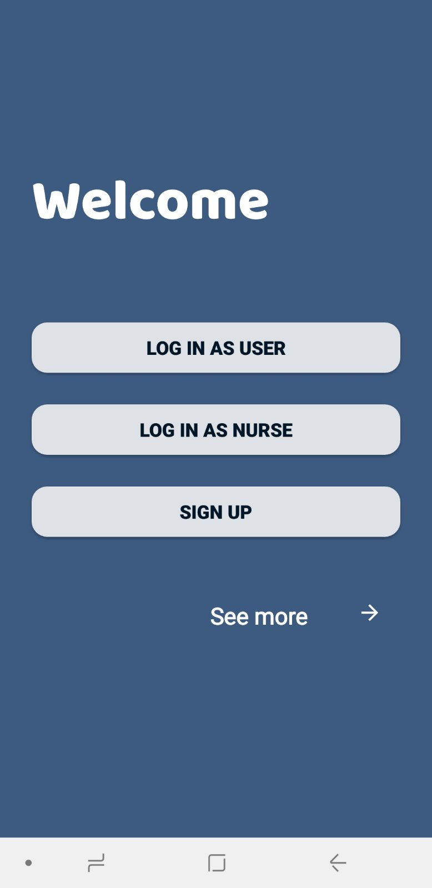

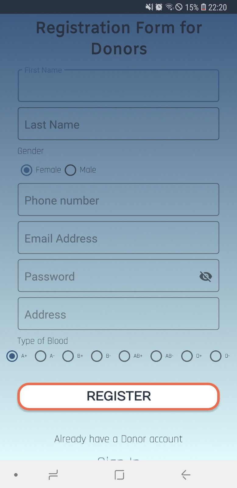
### Now you are signed up, and you got a blood donation account, but you have not donated yet blood so after login your account will be like this

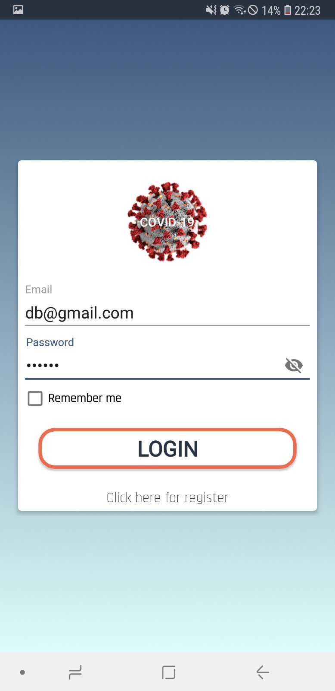
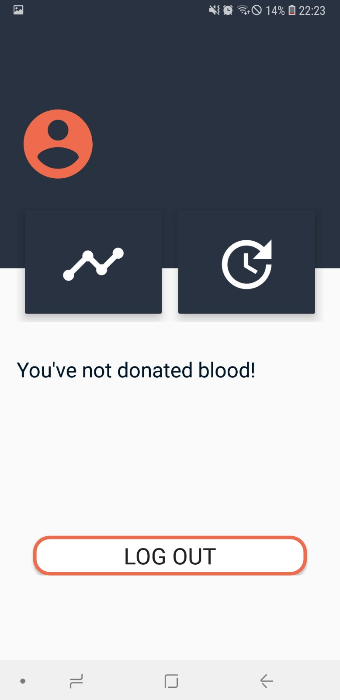

## Nurse App part

### To sign in as a Nurse the administrator of the app or an another Nurse should add an account for you.
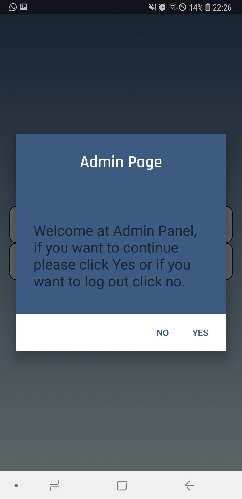

### This is a welcome page.
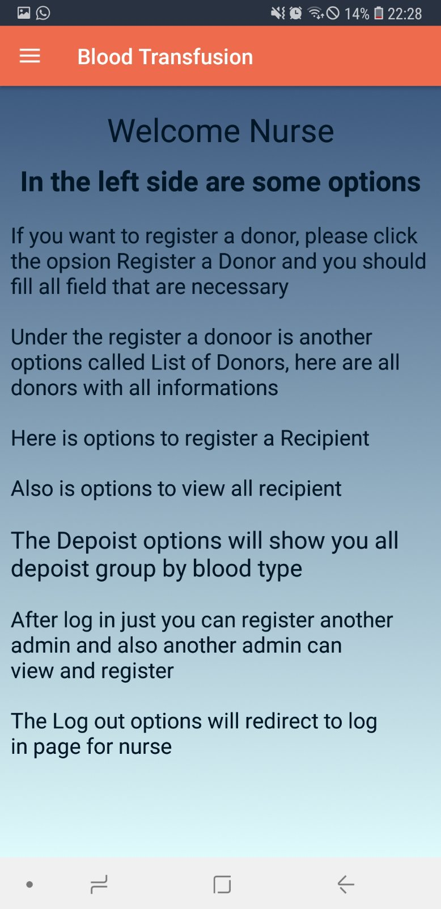

### This is list of donors that fetch real time data from firebase 
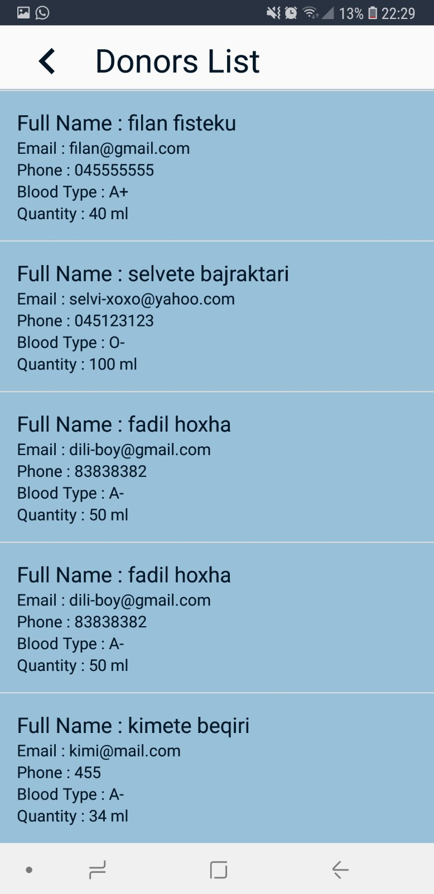

### Here can be found blood recipients
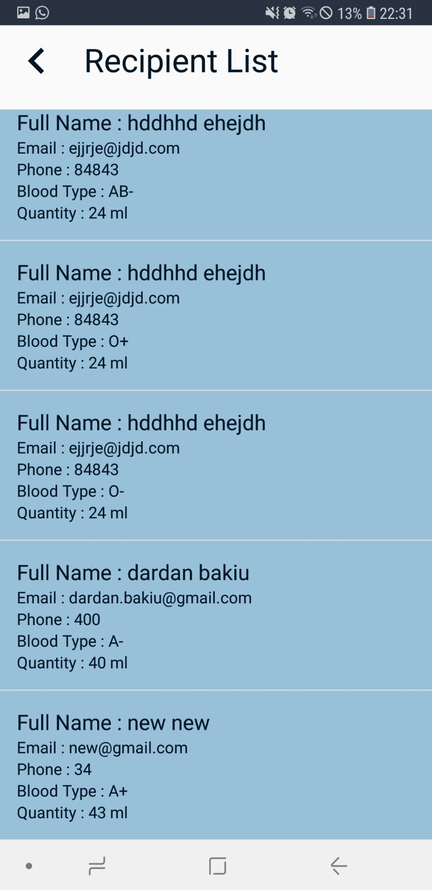

### This is deposit of all blood types that is stored
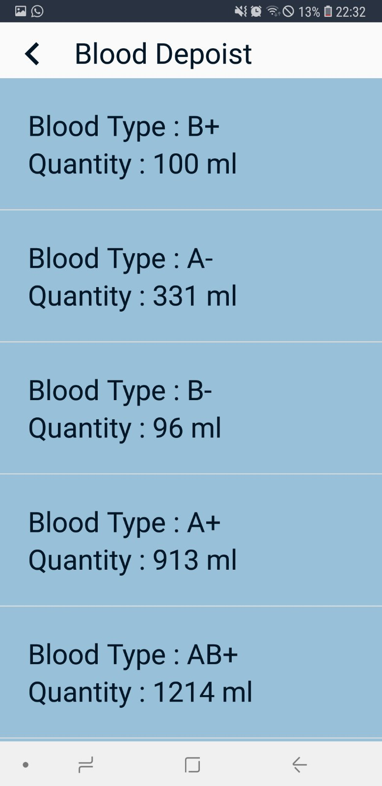

### Here you can add another admin (nurse) 
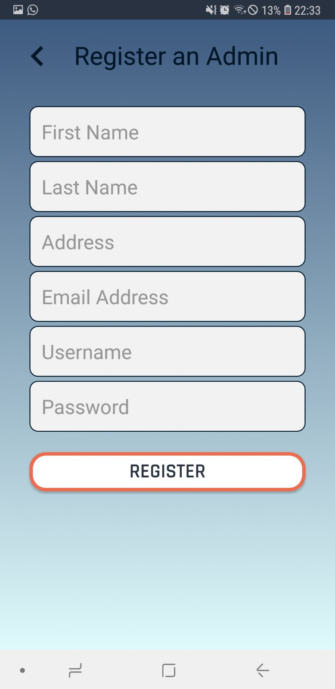

### Here you can add a blood reciever to database
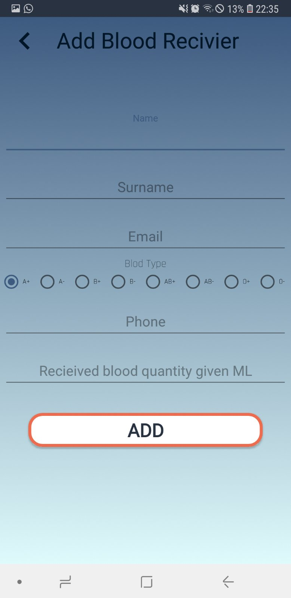

### Here you can add a blood donor to database
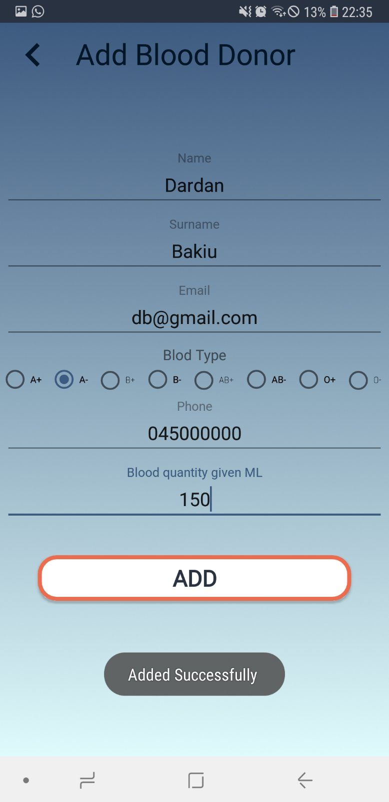

### Now when we login again as a user (donor) we see our blood history!
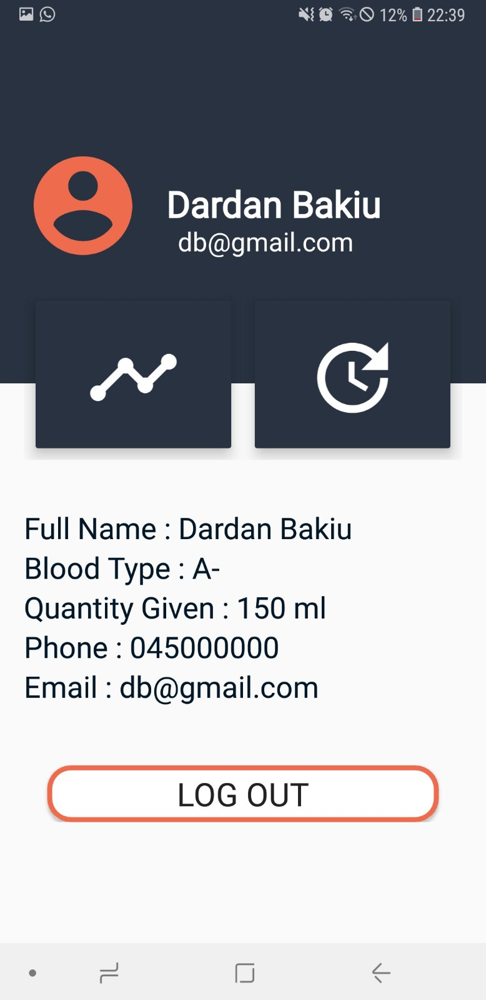
